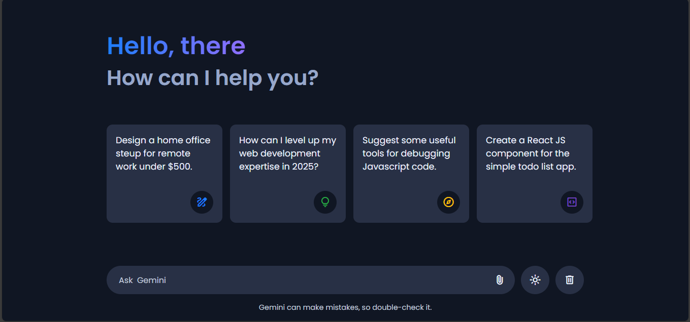

# Gemini AI Chatbot 

A modern AI chatbot built using **Google Gemini API**, featuring:
- Typing animation
- Markdown rendering (bold, lists, code blocks)
- Copy-to-clipboard for code
- File upload support
- Dark / Light theme
- Abort (Stop) response handling

##  Tech Stack
- HTML
- CSS
- JavaScript (Vanilla)
- Google Gemini API

##  Features
- Real-time typing effect
- Markdown parsing (bold, italic, lists, code blocks)
- Copy button for code snippets
- Image & file input
- Theme toggle (Dark / Light)
- Abort ongoing AI responses
- Responsive UI

##  Live Demo
 
## 🛠️ Setup Instructions
1. Clone the repo
2. Open `script.js`
3. Add your Gemini API key:
   ```js
   const API_KEY = "YOUR_API_KEY";



